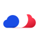

# JSON-Schema documentation project

 [](https://join.slack.com/t/fgribreau/shared_invite/zt-edpjwt2t-Zh39mDUMNQ0QOr9qOj~jrg)

## Sponsors

<table>
  <tr>
    <td align="center" width="175">
      <a href="https://france-nuage.fr/?mtm_source=github&mtm_medium=sponsor&mtm_campaign=france-nuage&mtm_content=json-schema-documentation">
        <br/>
        <b>France-Nuage</b>
      </a><br/>
      <sub>Sovereign EU cloud to host your API docs. Open &amp; re-internalisable.</sub>
    </td>
    <td align="center" width="175">
      <a href="https://www.hook0.com/?mtm_source=github&mtm_medium=sponsor&mtm_campaign=hook0&mtm_content=json-schema-documentation">
        <br/>
        <b>Hook0</b>
      </a><br/>
      <sub>Add webhooks to your API alongside your schema docs. Self-hostable.</sub>
    </td>
    <td align="center" width="175">
      <a href="https://getnatalia.com/?mtm_source=github&mtm_medium=sponsor&mtm_campaign=natalia&mtm_content=json-schema-documentation">
        <br/>
        <b>Natalia</b>
      </a><br/>
      <sub>AI voice agent answers customer calls about your API 24/7.</sub>
    </td>
    <td align="center" width="175">
      <a href="https://netir.fr/?mtm_source=github&mtm_medium=sponsor&mtm_campaign=netir&mtm_content=json-schema-documentation">
        <br/>
        <b>NetIR</b>
      </a><br/>
      <sub>Hire vetted French freelance API designers via mentored marketplace.</sub>
    </td>
  </tr>
  <tr>
    <td align="center" width="233">
      <a href="https://nobullshitconseil.com/?mtm_source=github&mtm_medium=sponsor&mtm_campaign=nbc&mtm_content=json-schema-documentation">
        <br/>
        <b>NoBullshitConseil</b>
      </a><br/>
      <sub>Tech advisory without the bullshit. API &amp; platform strategy for CTOs.</sub>
    </td>
    <td align="center" width="233">
      <a href="https://qualneo.fr/?mtm_source=github&mtm_medium=sponsor&mtm_campaign=qualneo&mtm_content=json-schema-documentation">
        <br/>
        <b>Qualneo</b>
      </a><br/>
      <sub>Qualiopi LMS for French training orgs. 32 indicators handled.</sub>
    </td>
    <td align="center" width="233">
      <a href="https://recapro.ai/?mtm_source=github&mtm_medium=sponsor&mtm_campaign=recapro&mtm_content=json-schema-documentation">
        <br/>
        <b>Recapro</b>
      </a><br/>
      <sub>Private AI meeting notes for your API design reviews. Stays sovereign.</sub>
    </td>
  </tr>
</table>

> **Interested in sponsoring?** [Get in touch](mailto:rust@fgribreau.com)

## Getting started

* [](https://www.npmjs.com/package/json-schema-documentation-cli) [Use the CLI](/packages/cli)
* [](https://www.npmjs.com/package/json-schema-documentation-generator) [Use the generator from code](/packages/generator)
*  [](https://www.npmjs.com/package/json-schema-documentation-theme-default) [Fork default theme](/packages/theme-default)


## Development

```bash
git clone git@github.com:fgribreau/json-schema-documentation.git
npm install
```
